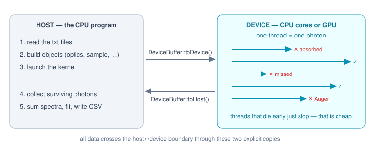

Hardware primer: threads, host & device
=======================================

The walkthroughs that follow show real voxTrace code. Before stepping through
the physics, this page explains — for readers who are not programmers — *where*
that code runs and why it is written the way it is. The short version:

    **One traced photon is one thread.** voxTrace simulates millions of
    photons, every photon's story is independent of every other's, and modern
    hardware is very good at telling millions of independent stories at once.

What a thread is, and why photons make perfect ones
---------------------------------------------------

A *thread* is one worker executing one sequence of instructions. A laptop CPU
has 8–16 workers; a GPU has tens of thousands of simpler ones. Work can be
split across them only if the pieces don't depend on each other — and
Monte-Carlo ray tracing is the textbook case: photon number 4711 never needs
to know what happened to photon 4710. So voxTrace hands **one photon index to
one thread** and lets the hardware run as many as it has workers:

.. code-block:: cpp

   // Run body(i) for i in [0, n) — Kokkos::parallel_for in the Kokkos build
   // (the functor is copied to the device), a plain loop in the host-only build.
   template <class Body>
   inline void forRange(const char* name, long n, const Body& body) {
   #ifndef VOXTRACE_HOST_ONLY
       Kokkos::parallel_for(name, Kokkos::RangePolicy<>(0, n), body);
       Kokkos::fence();
   #else
       for (long i = 0; i < n; ++i) body(i);
   #endif
   }

``body(i)`` is the *kernel* — the function that traces photon ``i`` from birth
to death. The same source line launches 2 million kernel calls whether the
machine underneath is one CPU core, sixteen, or a GPU.

One subtlety matters for science: **random numbers**. If every thread pulled
from one shared random generator, the result would depend on which thread ran
first — different every run, different on every machine. voxTrace instead
derives an independent random stream from the pair *(seed, photon index)*:

.. code-block:: cpp

   KOKKOS_INLINE_FUNCTION RNG makeRng(uint64_t seed, uint64_t idx) {
       return RNG(splitmix(seed ^ splitmix(idx)));
   }

Photon 4711 draws exactly the same "dice" whether it runs first, last, or on a
GPU — results are bit-for-bit reproducible at any thread count.

Host and device
---------------

Every run has two sides:

* The **host** is the CPU running the ordinary program: it reads the input
  files, builds the objects, launches kernels, collects results, runs the
  optimizer and writes CSVs. Everything in ``src/apps/voxTrace.cpp`` and
  ``src/io/SetupIO.hpp`` is host code.
* The **device** is wherever the kernels run: the CPU's own cores (OpenMP
  backend), an NVIDIA GPU (CUDA backend), or an AMD GPU (HIP). Everything in
  ``src/core/Beamline.hpp``, ``PolyCap.hpp``, the sample and detector classes
  is device-capable code, marked ``KOKKOS_INLINE_FUNCTION``.

   The division of labour: the host prepares objects and collects results; the device runs one photon per thread, and threads that die early simply stop.

A GPU has its **own memory**, so every object a kernel touches must be copied
over before launch. voxTrace funnels all of that through one class,
``DeviceBuffer`` — the *only* place data crosses the host/device boundary:

.. code-block:: cpp

   // Usage: fill host(), call toDevice(), hand device() to the kernel functor;
   // after the kernel, call toHost() before reading results.
   DeviceBuffer<Voxel> vox("voxels", voxels);   // host fills it
   vox.toDevice();                              // one explicit copy
   kernel.voxels = vox.device();                // raw pointer for the kernel

On a CPU-only build host and device pointers are the same memory and the
copies cost nothing; on a GPU they are real transfers over the PCIe bus —
which is why voxTrace copies the sample **once** and then reuses it for every
scan position, instead of copying per position.

Everything captured *by value* into a kernel (the ``PolyCap`` optic, the
``Detector``, the geometry frames) must be **trivially copyable** — plain
numbers in a struct, no pointers to host memory, no strings, no dynamic
containers. That is the reason the physics classes look austere: a
``PolyCap`` is ~40 floats describing the geometry, not a web of objects.

Kokkos backends: the same code on CPU or GPU
--------------------------------------------

voxTrace uses `Kokkos <https://kokkos.org>`_ as its portability layer. The
build target decides the backend; the physics source does not change:

===========================  ============================  ==============================================
Build                        Threads                       Typical use
===========================  ============================  ==============================================
``make voxtrace``            1 (host-only, plain loop)     debugging, small runs, laptops without OpenMP
``voxtrace-kokkos`` + OpenMP one per CPU core (8–16)       everyday runs on a workstation
``voxtrace-kokkos`` + CUDA   tens of thousands (GPU)       production statistics (10⁷–10⁹ photons)
===========================  ============================  ==============================================

Two hardware realities shape the kernel code you will see in the walkthroughs:

* **Threads that give up early are cheap.** Most photons are discarded long
  before the detector (they miss the optic, get absorbed, fluoresce the wrong
  way…). A discarded thread simply ``return``\ s — on a GPU that lane idles
  until its group finishes, which costs far less than any attempt to "refill"
  it. This is why the kernels are written as a cascade of early exits.
* **No thread ever writes to another thread's memory.** Each photon owns one
  *slot* in a results array (``slots[i]``); dead photons leave a sentinel
  (``w = -1`` or ``ch = -1``) and the host filters the survivors afterwards.
  No locks, no atomics, no waiting.

How the objects scale in memory
-------------------------------

When sizing a run (especially on a GPU with fixed memory), four allocations
matter — everything else is kilobytes:

=======================  ============================  ===========================================
Object                   Size                          Example (nist-1107)
=======================  ============================  ===========================================
Voxel grid               ``xN·yN·zN`` × ~144 B          60·60·30 = 108 000 voxels ≈ **16 MB**
                         (position, size, material,
                         27-neighbour table)
Beam-ray slots           ``min(n_primary, 2·10⁶)``      2 M slots × 72 B ≈ **144 MB**
                         × ``sizeof(ExitRay)``
Surviving beam rays      transmission × n_primary       1 % of 10⁷ = 100 k rays ≈ 7 MB
Event slots              one per beam ray × 16 B        100 k × 16 B ≈ 1.6 MB
=======================  ============================  ===========================================

The beam-slot line explains a pattern you will meet in the first walkthrough:
the beam is traced in **chunks of 2 million photons** —

.. code-block:: cpp

   const long CHUNK = 2000000;
   DeviceBuffer<vt::ExitRay> slots("beam-chunk",
                                   (size_t)std::min(CHUNK, (long)C.run.nPrimary));
   for (long base = 0; base < C.run.nPrimary; base += CHUNK) { ... }

— so device memory stays bounded no matter how many primaries you request:
``n_primary = 10⁹`` reuses the same 144 MB buffer 500 times rather than trying
to allocate 72 GB. After each chunk the host copies the slots back and keeps
only the survivors, so the *surviving* beam (usually a few percent) is what
accumulates in host RAM.

The voxel grid scales with the **cube** of resolution: halving the voxel size
in all three axes costs 8× the memory *and* 8× the fit parameters. The 27-entry
neighbour table per voxel is a classic memory-for-speed trade — the voxel walk
follows precomputed indices instead of searching.

Precision is a deliberate mix: **storage is float, transient trace state is
double**. Grazing-angle reflections in the polycapillary compound tiny errors
over dozens of bounces, so the bounce loop runs in double; but tables and
geometry stay float, halving memory and doubling effective bandwidth.

Reading the walkthroughs
------------------------

With that vocabulary, the annotated chains are:

* :doc:`walkthrough-cmxrf` — the full confocal chain and the deepest dive;
  start here.
* :doc:`walkthrough-muxrf` — µXRF: what changes when the second optic is
  replaced by a bare detector aperture.
* :doc:`walkthrough-xrf` — XRF: what changes when the source shines on the
  sample directly.

Whenever a step has a hardware angle, the walkthroughs mark it with a
*"where this runs"* note like this one:

.. admonition:: Where this runs

   Loading input files: **host**. Tracing photons: **device kernel**, one
   photon per thread. Summing spectra and fitting: **host**.
