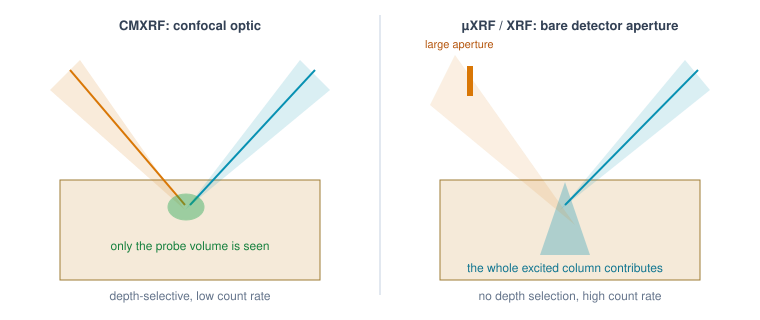

Trace walkthrough — µXRF (scanning micro-XRF)
=============================================

The µXRF preset runs the chain

    **source → primary polycapillary → sample → detector**

— the confocal chain *without* the secondary optic. In ``Setup.txt`` that is
simply

.. code-block:: text

   chain = source,primary,sample,detector

and in the code a single flag: ``ScanKernel.hasSecondary = false``. This page
walks the same trace as :doc:`walkthrough-cmxrf` but focuses on what changes;
read the CMXRF page for the full step-by-step and the
:doc:`hardware-primer` for the host/device vocabulary.

What is identical
-----------------

Stages 1 and 2 begin exactly as in the confocal walkthrough:

* ``loadConfig`` builds the same objects — minus the second ``PolyCap``;
* ``BeamKernel`` traces the focused beam through the primary optic once (dice
  energy → source disc → reflection loop → transmitted exit rays, everything
  else thrown away via the ``w = -1`` sentinel);
* scan steps (1)–(5) are unchanged: surface entry, voxel walk to the
  interaction point, emission direction, fluorescence-or-scatter dice,
  self-absorption on the way out.

What changes: the collection window is a bare aperture
------------------------------------------------------

Without a collecting optic, the "window" the emitted photon must reach is a
plain disk — the detector's aperture, described by two ``Setup.txt`` numbers:

.. code-block:: text

   det_distance_cm = 1.0     # aperture distance from the scan point
   det_radius_cm   = 0.3     # aperture radius

The host wires them into the kernel where the confocal build would have used
the secondary optic's focal distance and entrance radius:

.. code-block:: cpp

   .aimDist = C.secondary ? C.pcSec.focalDown : C.run.detDistance,
   .rWin    = C.secondary ? C.pcSec.rExtDown  : C.run.detRadius,

In *importance-sampling* mode (``variance_reduction = 1``, ``ScanKernel``)
nothing else is needed: emission is aimed at a random point of that disk and
the solid-angle weight ``wEmit`` already accounts for the geometry — a much
larger disk than a polycap entrance, so far more photons survive per primary.
In *brute-force* mode (``AnalogKernel``) the photon leaves the sample in
whatever direction its last interaction gave it and must hit the disk
geometrically:

.. code-block:: cpp

   double tn = dot(d, d_sec);
   if (tn <= 0) return false;              // flying away from the detector
   double tt = dot(aimCtr - P, d_sec) / tn;
   Vec3 miss = P + d*tt - aimCtr;
   if (dot(miss, miss) > rWin*rWin) return false;   // misses the disk

Step (6) of the confocal chain — ``secondary.trace(sray)`` and its
transmission weight ``wSec`` — disappears entirely; ``wSec`` stays 1. Step (7),
the Si(Li) detector response, is unchanged. Because the aperture disk is so
much easier to hit than a polycap entrance, this is also the one chain where
brute force is cheap enough for a laptop — about 6 × 10² candidates per
detected photon (see :doc:`cost-vs-accuracy`).

What that means physically
--------------------------

   What the secondary optic bought: confocal collection sees only the probe volume; a bare aperture sees the entire excited column.

The secondary optic was the *confocal filter*: it accepted only photons born
near its focal spot. Without it, the detector sees fluorescence from the
**entire illuminated column** — every voxel the focused beam excites on its
way through the sample, weighted only by self-absorption. Two practical
consequences you can see in the results:

* **No depth discrimination.** Scanning the sample in z changes the signal
  only through beam focusing and self-absorption, not through a probe-volume
  overlap. Depth information must come from modelling (that is exactly what
  the voxel-weight fit reconstructs).
* **Far higher count rates per primary photon.** The collection solid angle
  of a centimetre-scale aperture dwarfs a polycap entrance; typical runs need
  markedly fewer primaries for the same statistics — the weight ``wEmit`` is
  larger and step (6) no longer rejects anyone.

.. admonition:: Where this runs

   Same layout as CMXRF: beam kernel and scan kernel on the device, one photon
   per thread; the scan kernel is *cheaper* per thread here because the most
   expensive survivor step (the secondary optic's reflection loop) is gone.

Everything downstream — event summation, exposure scaling, Poisson noise,
``recon_spectra.csv``, the optional voxel-weight fit — is byte-for-byte the
same code as in the confocal walkthrough.
